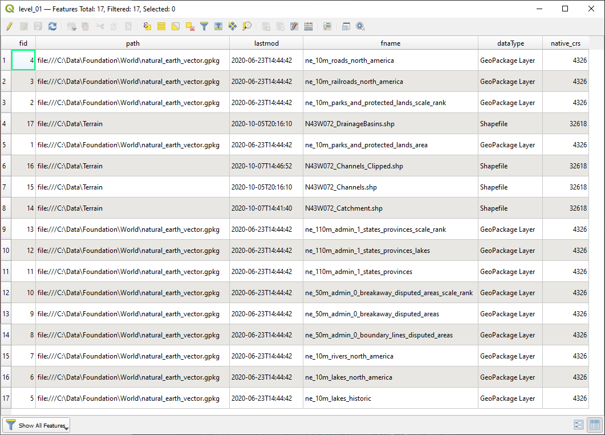

# geoindexer

GeoIndexer is intended to help people with large amounts of uncatalogued spatial data to discover and catalogue it spatially.  It often happens in large organizations where a NAS/SAN might get stuffed with content and nobody really has a good idea of what data covers what locations on the earth.  GeoIndexer can find and represent these holdings by either points (discrete locations) or polygons (coverage extents) that can be overlaid on a map and used to quickly locate and use the asset.

## data types supported
1. Raster (TIFF, DTED, NITF, maybe .jp2 - more testing is needed)
2. Vector (SHP, containerized content such as Esri feature classes, GeoPackage layers, KML layers)
3. Lidar (.las, .laz)
4. Web images (JPEG, and - theoretically - PNG)

#### under development
* valid GeoJSON files
* OpenStreetMap Planet Binary Format (.pbf) files
* optional convex hull output

#### future plans
* explicit/implicit location parsing in common document formats (.docx, .odt, .txt, .pdf)
* containerized raster layers (GeoPackaged rasters, virtual raster tables)
* explore using Esri's `arcpy` package in a version for ArcGIS users

## installation
`git clone https://github.com/vovchykbratyk/geoindexer.git`

This project has been a learning experience for me, eventually I will sit down and learn how to publish this for `pip` installation and will update this section.

### dependencies/requirements
```fiona, gdal, geopandas, pdal, PIL, pyproj, rasterio, shapely```

## example usage
Here is a simple example using GeoIndexer to discover and construct coverage geometry for GeoPackage layers, File Geodatabase layers, Lidar point clouds, JPEG images, TIFF rasters and NITF rasters, outputting the coverage to a set of GeoPackage layers for various coverage scales.
```
from geoindexer import GeoCrawler, GeoIndexer


if __name__ == '__main__':

    searchpath = "C:/path/to/data"
    ftypes = ['gpkg', 'kml', 'kmz', 'jpg',
              'jpeg', 'las', 'laz', 'tif',
              'tiff', 'ntf', 'nitf', 'dt0',
              'dt1', 'dt2', 'shp', 'gdb']
    logpath = "C:/Temp"

    search = GeoCrawler(searchpath, ftypes).get_file_list()
    results = GeoIndexer(search).get_extents(logging=logpath)

    # Split out the results to do stuff with them
    cvg_areas = results[0]
    statistics = results[1]
    failures = results[2]

    # Output it as a GeoPackage
    gpkg = 'C:/Temp/gpkg_test_fiona.gpkg'
    areas = GeoIndexer.to_geopackage(cvg_areas,
                                     path=gpkg)

    print('--------------------------')
    print('--------STATISTICS--------')
    print('--------------------------')
    for k, v in statistics.items():
        print(f"{k.title().replace('_', ' ')}: {v}")

    print('')

    for k, v in failures.items():
        print(f'Failed {k.title()}:')
        for x in v:
            if k == "layers":
                print(f'\t{" | ".join(x)}')
            else:
                print(f'\t{x}')


```
This will give you output like the following:


### Map output


